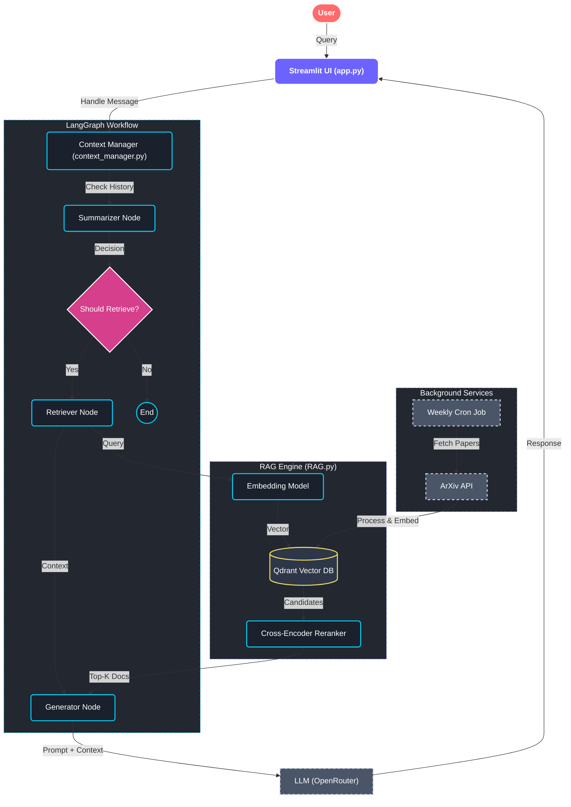

# ML Research RAG Chatbot

A premium, intelligent chatbot designed to answer questions about Machine Learning research papers. It leverages a robust **Retrieval-Augmented Generation (RAG)** pipeline to provide accurate, context-aware answers grounded in the latest academic literature.

**🚀 Deployed Application:** [https://mlresearch-rag.streamlit.app/](https://mlresearch-rag.streamlit.app/)

---

## 🏗️ High-Level Architecture

The system is built on a modular architecture separating the UI, orchestration, and core RAG logic.



---

## 🧩 Detailed Component Overview

### 1. Frontend & User Interface (`app.py` & `style.css`)
- **Framework:** Built with **Streamlit** for a responsive and interactive web application.
- **Design:** Features a **premium, glassmorphism-inspired UI** with:
    - Custom CSS for dark mode, smooth animations, and translucent elements.
    - Mobile-responsive layout ensuring a great experience on all devices.
    - Real-time streaming of LLM responses for a fluid conversational feel.
- **Functionality:**
    - Manages user sessions and chat history.
    - Displays LaTeX formulas correctly for mathematical explanations.
    - Provides a sidebar for triggering manual file ingestion.

### 2. Orchestration & Memory (`context_manager.py`)
- **LangGraph:** Uses a state machine to manage the conversation flow.
- **Smart Memory:**
    - **Short-term Memory:** Keeps the most recent messages for immediate context.
    - **Summarization:** Automatically condenses older parts of the conversation using an LLM to maintain long-term context without exceeding token limits.
- **Token Management:** Dynamically trims prompts and history to fit within the model's context window (default 3000 tokens).
- **Thread Management:** Assigns unique IDs to conversations for persistent state management.

### 3. Core RAG Logic (`RAG.py`)
- **Retrieval:**
    - **Embedding:** Uses `sentence-transformers/all-MiniLM-L6-v2` to convert queries into vectors.
    - **Vector DB:** Queries **Qdrant** to find the most relevant document chunks.
- **Reranking:**
    - **Cross-Encoder:** Uses `cross-encoder/ms-marco-MiniLM-L-6-v2` to re-score the initial candidates. This step significantly improves accuracy by analyzing the deep semantic relationship between the query and the documents.
- **Generation:**
    - **LLM:** Connects to high-performance models (e.g., via OpenRouter) to generate answers.
    - **Citation System:** The system prompt enforces strict evidence-based answering, requiring inline citations (e.g., `[1]`) and a reference list of source files.

### 4. Data Ingestion
- **Automated Pipeline:** A weekly cron job fetches top trending ML papers from ArXiv.
- **Processing:** Papers are chunked, embedded, and stored in the Qdrant vector database.
- **Manual Trigger:** Users can request ingestion of specific files via the UI, which triggers a remote ingestion service.

---

## 🛠️ Setup & Installation

### Prerequisites
- Python 3.8+
- API Keys: OpenRouter, Qdrant

### Installation

1. **Clone the repository:**
   ```bash
   git clone https://github.com/your-repo/ml-research-rag.git
   cd ml-research-rag
   ```

2. **Install dependencies:**
   ```bash
   pip install -r requirements.txt
   ```

3. **Configure Environment Variables:**
   Create a `.env` file in the root directory:
   ```env
   QDRANT_URL=<your_qdrant_url>
   QDRANT_API_KEY=<your_qdrant_api_key>
   QDRANT_COLLECTION=document_chunks
   OPENROUTER_API_KEY=<your_openrouter_key>
   INGESTION_SERVICE_URL=<ingestion_service_url>
   ```

4. **Run the Application:**
   ```bash
   streamlit run app.py
   ```

---

## 📊 Performance & Configuration

| Parameter | Default | Description |
|-----------|---------|-------------|
| `retrieve_k` | 50 | Number of initial candidates fetched from Vector DB |
| `final_k` | 5 | Number of top documents kept after reranking |
| `token_budget` | 3000 | Maximum tokens allowed in the LLM prompt |
| `summary_threshold` | 8 | Number of messages before summarization triggers |

---

## 🔄 Data Flow Summary

1. **User Input:** The user asks a question in the Streamlit UI.
2. **Context Check:** `ContextManager` loads the conversation history.
3. **Retrieval:** `RAG.py` converts the query to a vector and searches Qdrant.
4. **Refinement:** The Cross-Encoder reranks the results to find the best matches.
5. **Prompting:** A prompt is built with the system instructions, history, and top context chunks.
6. **Generation:** The LLM generates a streamed response with citations.
7. **Display:** The answer is shown to the user, and the conversation state is updated.